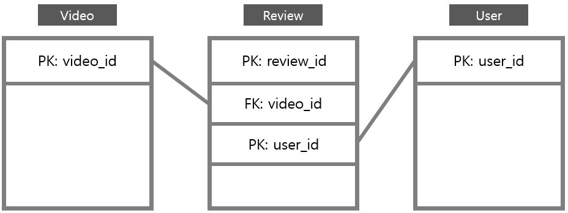
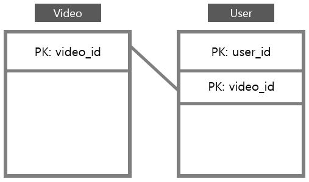

# Application 설계

## View - Template Flow

### * User management

| VIEW | TEMPLATE                   | description        | url  |
| ---- | -------------------------- | ------------------ | ---- |
|      | register.html              | 회원 가입          |      |
|      | login.html                 | 로그인             |      |
|      | logged_out.html            | 로그아웃           |      |
|      | forgot_pw.html             | 비밀번호 찾기      |      |
|      | user_info_update.html      | 회원정보 수정      |      |
|      | register_done.html         | 가입 축하          |      |
|      | user_info_update_done.html | 회원정보 수정 완료 |      |

### * Main Home

| VIEW                           | TEMPLATE    | description      | url  |
| ------------------------------ | ----------- | ---------------- | ---- |
| class HomeView(TemplateView)   | home.html   | 메인 홈 페이지   |      |
| class SearchFormView(FormView) | search.html | 검색 결과 페이지 |      |

### * List

| VIEW                             | TEMPLATE        | description                                   | url  |
| -------------------------------- | --------------- | --------------------------------------------- | ---- |
| class VideoTypeView(ListView)    | video_type.html | 상단 메뉴바에서 영화나 드라마로 분류된 페이지 |      |
| class TopVideoView(ListView)     | topvideo.html   | ''추천'' 순서대로 top10 list 출력 하는 페이지 |      |
| class CategoryView(TemplateView) | category.html   | 장르 리스트를 나열                            |      |
| class GenreListView(ListView)    | genre_list.html | 장르별 영상 리스트 출력 페이지                |      |

### * Detail

| VIEW                               | TEMPLATE           | description                             | url  |
| ---------------------------------- | ------------------ | --------------------------------------- | ---- |
| class VideoDetailView(DetailView)  | movie_detail.html  | 영상 정보와 함께 영상이 재생되는 페이지 |      |
| class ReviewListView(ListView)     | 미정..             | 영상 재생 화면 아래에 리뷰 리스트       |      |
| class ReviewDetailView(DetailView) | review_detail.html | 리뷰 상세보기 페이지                    |      |

### * Video Management

| VIEW                                              | TEMPLATE                  | description                  | url  |
| ------------------------------------------------- | ------------------------- | ---------------------------- | ---- |
| class VideoUploadView(CreateView)                 | video_upload_form.html    | 영상 업로드 (superuser only) |      |
| class VideoUpdateView(OwnerOnlyMixin, UpdateView) | video_upload_form.html    | 영상 수정                    |      |
| class VideoDeleteView(OwnerOnlyMixin, DeleteView) | video_delete_confirm.html | 영상 삭제                    |      |

### * Review Management

| VIEW                                               | TEMPLATE                   | description                  | url  |
| -------------------------------------------------- | -------------------------- | ---------------------------- | ---- |
| class ReviewView(CreateView)                       | review_upload_form.html    | 리뷰 업로드 (superuser only) |      |
| class ReviewUpdateView(OwnerOnlyMixin, UpdateView) | review_upload_form.html    | 리뷰 수정                    |      |
| class ReviewDeleteView(OwnerOnlyMixin, DeleteView) | review_delete_confirm.html | 리뷰 삭제                    |      |

## Model 

### Video table

| 컬럼명       | 타입         | 제약조건                      | 설명                |
| ------------ | ------------ | ----------------------------- | ------------------- |
| title        | varchar(120) | Not null                      | 영상 제목           |
| description  | varchar(500) | null                          | 영상에 대한 설명    |
| release_dt   | date         | Not null                      | 개봉일자            |
| genre        | tag          | null                          | 장르                |
| running_time | integer      | Not null                      | 재생 시간           |
| director     | varchar(100) | Not null                      | 감독 이름           |
| video_type   | boolean      | Not null, value In ('d', 'm') | 영화와 드라마 구분  |
| video_id     | integer      | Not null, pk, Auto Increment  | Primary Key         |
| recommend    | integer      | Not null                      | 영상이 추천 받은 수 |
| grade        | integer      | Not null                      | 영상 관람 연령 등급 |

### Review table

| 컬럼명    | 타입         | 제약조건 | 설명                |
| --------- | ------------ | -------- | ------------------- |
| re_title  | varchar(120) | Not null | 리뷰 제목           |
| content   | text         | Not null | 리뷰 본문 내용      |
| create_dt | date         | Not null | 작성 일자           |
| modify_dt | date         | null     | 수정 일자           |
| user_id   | varchar(50)  | Not null | 작성자, Foreign Key |
| video_id  | integer      | Not null | 영상, Foreign Key   |
| like      | integer      | Not null | 좋아요 기능         |
| re_id     | integer      | Not null | Primary Key         |

### User table

| 컬럼명        | 타입         | 제약조건 | 설명                     |
| ------------- | ------------ | -------- | ------------------------ |
| user_id       | varchar(50)  | Not null | 아이디, Primary Key      |
| password      | varchar(128) | Not null | 비밀번호                 |
| age           | integer      | Not null | 나이                     |
| gender        | boolean      | Not null | 성별                     |
| phone_number  | varchar(120) | Not null | 전화번호                 |
| email         | email        | Not null | 이메일                   |
| name          | varchar(150) | Not null | 실명                     |
| joined_dt     | date         | Not null | 가입 일자                |
| is_superviser | TINYINY      | Not null | 관리자 여부              |
| last_login    | date         | Not null | 최근 로그인 일자         |
| is_staff      | TINYINY      | Not null | 직원 여부                |
| is_active     | TINYINY      | Not null | 로그인 허용 여부         |
| bookmark      | integer_list | null     | 찜하기 기능, Foreign Key |

## ERD

